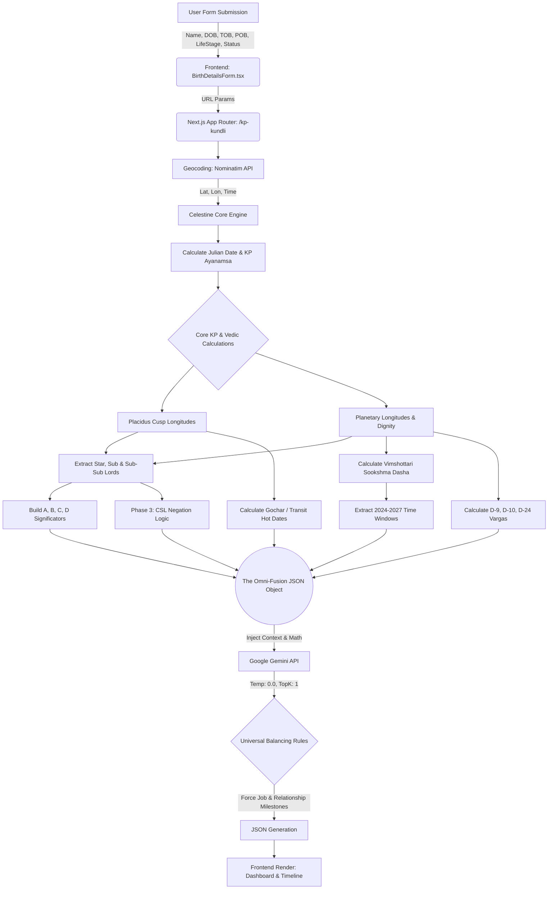

# 🔮 AI Astrology Engine - Low-Level Architecture (LLA)

This document details the low-level architecture, algorithms, and data flow of the deterministic AI Astrology Engine as implemented today.

---

## 1. Core Stack & Libraries
- **Frontend Framework:** Next.js (App Router), React 18, Tailwind CSS, Framer Motion.
- **Astrological Math Engine:** `celestine` (Swiss Ephemeris-based high-precision calculations).
- **AI Engine:** Google Gemini SDK (`@google/genai`), forcing deterministic JSON outputs.
- **Deployment:** Vercel.

---

## 2. Mathematical Pipeline (Backend)

### 2.1 Coordinate & Planetary Initialization
- **Geocoding:** Nominatim API converts Place of Birth (POB) into exact Latitude and Longitude.
- **Initialization:** `celestine` is fed the Date, Time, Lat, Lon, and precise Timezone offset.
- **Ayanamsa:** Standard Lahiri Ayanamsa is calculated via a precise Julian Century polynomial, modified slightly to yield the KP Ayanamsa.

### 2.2 KP System Mechanics (`src/lib/kpAstrology.ts`)
- **Placidus House System:** Cusp longitudes are strictly calculated using Placidus mathematics to find exact House degrees.
- **Lordship Mapping:** For every Planet and Cusp, the engine calculates:
  - **Sign Lord** (Rasi)
  - **Star Lord** (Nakshatra)
  - **Sub Lord** (CSL)
  - **Sub-Sub Lord** (CSSL)
- **4-Fold KP Significators (A, B, C, D):** 
  - Level A: Houses occupied by the planet's Star Lord.
  - Level B: House occupied by the planet.
  - Level C: Houses owned by the planet's Star Lord.
  - Level D: Houses owned by the planet.

### 2.3 Vargas (Divisional Charts)
- **Navamsa (D-9):** Calculates exact 3°20' segments for marriage/inner-self dignity.
- **Dasamsa (D-10):** Calculates exact 3° segments for career mapping.
- **Chaturvimsamsa (D-24):** Calculates exact 1°15' segments for educational prowess.

### 2.4 Micro-Timing (Vimshottari Dasha)
- **Depth:** Calculates the Mahadasha -> Antardasha -> Pratyantardasha -> **Sookshma Dasha** (4th level).
- **Targeting:** It extracts exact Sookshma windows specifically bounded within the immediate years (2024 to 2027) for laser-focused future timing.

---

## 3. The Logic Layer (Anti-Hallucination Controls)

### 3.1 Planetary Power Scores
- Calculates numerical strength (0 to 100) based on placement (Exalted, Moolatrikona, Own Sign, Friendly, Enemy, Debilitated).

### 3.2 Phase 3: Advanced Negation Logic
- A rigid mathematical parser checks the exact CSL placements against positive and destructive houses.
- Example: If the 10th CSL signifies houses 2, 6, 10, 11 (Career Promise) but its Star Lord signifies 1, 5, 9 (Career Denial), the engine flags the career status as `HAPPENS_BUT_WITH_STRUGGLES_AND_DELAYS`.
- **Enforcement:** The AI is strictly ordered to obey these boolean flags and is forbidden from hallucinating success if the math dictates denial.

### 3.3 Phase 4: Chronological Lock & User Context
- The user's explicitly provided `lifeStage` (e.g., Fresher) and `relationshipStatus` (e.g., Committed) dynamically restrict the AI's timeline mapping.
- **The Absolute Strongest Rule:** The AI is mathematically forced to lock major milestones into the *absolute strongest* valid Sookshma window between 2024 and 2026, completely banning "future skipping" (pushing events to 2028).

---

## 4. Omni-Fusion AI Engine (Gemini)

- **Absolute Determinism:** The model runs at `temperature: 0.0`, `topP: 0.1`, `topK: 1`. It operates as a rigid logic synthesizer, not a creative writer.
- **Universal Balancing Rule:** The prompt forces the AI to output exactly 6 breakthroughs, universally guaranteeing that at least one pertains to Career and one pertains to Relationships (based on User Context), regardless of skewed planetary scores.
- **Output:** A strict, validated JSON schema containing structured readings for Career, Love, Wealth, Health, Education, and the 6 Breakthroughs.

---

## 5. System Workflow (Mermaid Diagram)

